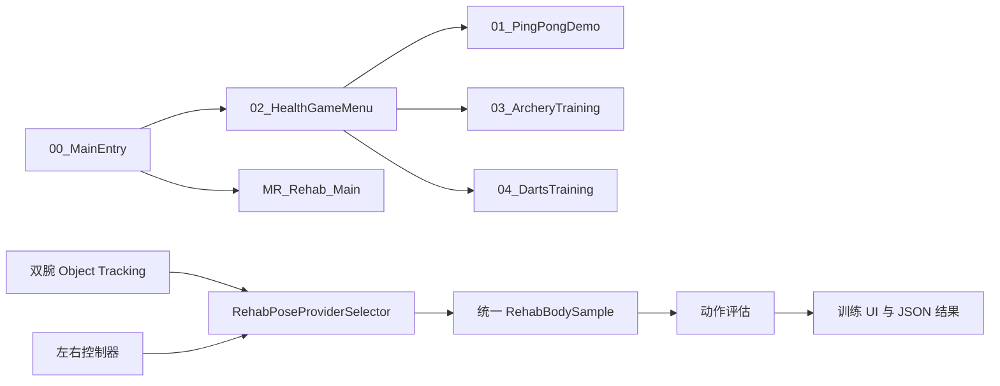

# PICO ElderCare VR/MR

面向 PICO 一体机的适老化 VR/MR 康养训练原型。项目以“低学习成本、坐姿可用、减少误触、可追踪和可回归”为设计目标，仓库当前实现两条训练链路：

- **健康游戏**：乒乓球、双手射箭、单手飞镖。
- **康复运动**：八段锦、太极动作引导、动作完成度评估与训练结果记录。

项目基于 Unity 2022.3 LTS 和 PICO XR SDK，运行入口、训练场景、追踪适配、物理解算、适老化世界空间 UI 与编辑器自测工具均保存在本仓库中。

> [!IMPORTANT]
> 本项目是康复辅助训练与交互研究原型，不是医疗器械，不提供疾病诊断、治疗建议或临床疗效结论。动作评分用于训练反馈，不等同于医学评估。

   

## 当前范围

| 模块 | 当前实现 |
| --- | --- |
| 主入口 | `VR康养服务` 世界空间首页；健康游戏和康复运动可进入；VR 旅游、场景视频为待接入入口；提供追踪器设置和退出确认。 |
| 健康游戏 | 独立的乒乓球、射箭、飞镖训练场景，包含计分、难度、训练轮次、反馈和返回导航。 |
| 康复训练 | 八段锦与太极训练；动作视频引导；完成度、对称性、节奏和安全状态反馈；结果保存为 JSON。 |
| 追踪 | 当前主路径为双腕 PICO Motion Tracker Object Tracking，控制器追踪自动降级；旧 Body Tracking 适配器保留用于测试和 A/B，不与 Object Tracking 同时占用设备模式。 |
| MR | PICO Video See-Through、房间感知、平面检测、内容朝向/高度校准和空间摆放。 |
| 工程工具 | 安全场景同步、独立玩法构建/修复、批处理自测、截图导出、远程输入测试和追踪诊断。 |

上表描述的是代码与场景的实现范围，不代表已经完成临床验证、大规模老年用户研究或全部设备组合验收。适老化、坐姿和轮椅相关能力是当前设计目标与交互实现，实际适用范围仍需在目标人群和具体设备上验证。

当前主构建包含以下 6 个场景：

| 场景 | 职责 |
| --- | --- |
| `00_MainEntry` | 应用首页、追踪器设置、退出入口。 |
| `02_HealthGameMenu` | 健康游戏二级选择页。 |
| `01_PingPongDemo` | 乒乓球训练；可由构建器切换 VR/MR 配置。 |
| `03_ArcheryTraining` | 双手协作射箭训练。 |
| `04_DartsTraining` | 单手投掷飞镖训练。 |
| `MR_Rehab_Main` | 八段锦/太极康复训练、视频引导、动作评估。 |

`00_DeviceTest`、`Debug/` 和 `BPlus/` 下的场景用于设备验证或 UI 试验，不在默认 Build Settings 中。

## 核心设计

### 适老化交互与安全

- 世界空间 UI 使用大字号、高对比度、明确 hover/选中反馈和较大的点击区域。
- 射箭、飞镖和康复内容会根据 HMD 高度与当前朝向重新对准，兼顾站姿、坐姿和轮椅使用。
- Grip 和扳机采用双阈值迟滞，降低模拟量抖动导致的重复触发。
- `IUiHoverGuard`、操作中射线屏蔽和点击前取消玩法操作共同避免“点按钮时误射箭/误投镖”。
- 康复训练检测用户是否离开训练圈，超过安全距离时暂停，回到范围后恢复；全局守卫持续禁用摇杆移动、转向和传送，减少眩晕与误移动风险。
- 飞镖的慢速松手视为“放回”，射箭拉距不足时不发射，避免轻微抖动变成有效操作。

### 场景与模块边界

主入口、健康游戏菜单、三个游戏和康复训练使用独立场景。共享能力通过小型组件、纯函数 Solver、输入接口、主题与编辑器工具复用，不把某个玩法的运行时对象注入另一个玩法。



### 可测试的解算层

- `PingPongHitSolver` 负责乒乓球碰撞响应、自旋转移、摩擦和方向约束。
- `ArcherySolver` 负责拉弓状态、出箭速度、环数、弹道预测、辅助瞄准与高度/朝向校准。
- `DartsSolver` 负责投掷速度重映射、晚松手峰值回溯和低速抛体的精确弹道辅助。
- 解算逻辑尽量保持无场景副作用，使边界值可以通过 Unity batchmode 回归，而不依赖头显实时输入。

## 功能模块

### 乒乓球

- 右手球拍跟随控制器；左手可抓球、释放球和拖动球桌摆放把手。
- 自动发球支持 `Basic`、`Topspin`、`Backspin`、`Sidespin`、`RandomMixed` 五种 profile。
- 球体包含空气阻力与 Magnus 效应，球拍接触会计算线速度、角速度和接触点速度。
- `ContinuousDynamic` 与 `SphereCastNonAlloc` 扫掠共同降低高速球穿桌/穿拍概率。
- VR/MR 模式共享玩法代码；MR 下可检测地面、调整球桌位置并用 `PlayerPrefs` 保存。

### 射箭

- 一手持弓、另一手搭弦和拉弓，支持左右利手切换与偏好持久化。
- 根据拉距计算出箭速度；瞄准方向带低通平滑，减轻手抖影响。
- 辅助瞄准只在接近正确方向时进行有限角度纠偏，并显示弹道预览，不接管明显偏离目标的发射。
- 箭矢使用重力、线性阻力和 SphereCast 扫掠；命中后提供插靶、飘分、音效、粒子与触觉反馈。
- 每轮 10 箭，支持近/中/远难度、星级评价、鼓励语和历史最佳成绩。

### 飞镖

- 任一手握紧 Grip/扳机拿镖，挥臂后松手投出，支持左右投掷手切换。
- 时间窗平均速度降低单帧抖动；短时间内晚松手时可回溯挥臂峰值。
- 投掷速度超过阈值后连续映射到镖速，避免“加力但速度不变”的反馈死区。
- 飞镖速度低于箭矢，辅助瞄准使用无阻力弹道二次方程求低抛角；不可达目标不强制纠偏。
- 每轮 10 镖，支持三档距离、计分、飘分、音效、粒子、星级和历史最佳。

### 康复训练

- **八段锦**：当前详细流程拆分为 30 个适老动作切片，覆盖预备、托天、开弓、单举、后瞧、摇头摆尾、攀足、攒拳和收势等阶段。
- **太极**：包含起势、云手、野马分鬃、白鹤亮翅、搂膝拗步和收势 6 个训练动作。
- 训练开始前采集自然姿态，冻结初始朝向并建立用户相对坐标系，减少身高、站位和之后看向 UI 对动作轴的影响。
- 评估使用头部与双腕/双手的位置和方向，输出完成度、对称性、节奏、保持时间及提示语。
- 八段锦支持按动作绑定的视频片段，视频面板可以独立于训练圈重新摆放、暂停和恢复。
- 训练包含准备、倒计时、动作执行、恢复、超时跳过、安全暂停和结束结果页。
- 结果通过 `TrainingResultRecorder` 写入 `Application.persistentDataPath/RehabResults/*.json`，记录动作级完成度、对称性、节奏、安全警告和结束原因。

当前结果记录器只写入设备本地文件，项目没有实现训练记录网络上传，也没有提供应用内的结果浏览和删除界面。调试或演示设备上的数据应通过设备文件管理或清除应用数据进行管理。

> 当前腕部 Object Tracking 只直接提供 HMD、左腕和右腕三类关节点。因此脚步、膝关节和足跟幅度不会被伪造推断；相关动作只做上肢/头部可观测部分与安全提示。完整下肢评估需要额外传感器和临床验证。

### PICO 追踪架构

`IRehabPoseProvider` 将训练逻辑与设备 SDK 解耦：

- `PicoWristObjectTrackingProvider`：当前主要追踪源，读取两枚腕部 Motion Tracker。
- `ControllerPoseProvider`：追踪器未连接、未绑定、丢失或用户选择控制器模式时的降级来源；它直接把控制器 Transform 作为腕部代理，用于保证训练可继续，不表示与腕部追踪具有相同精度。
- `RehabPoseProviderSelector`：支持 `Auto`、`ControllersOnly` 和 `WristTrackersOnly`，并在来源实际切换时通知训练会话重置当前动作状态。
- `PicoBodyTrackingProvider`：保留的 Body Tracking 适配与 Fake API 测试路径；`WristTrackingRuntime` 启用时会主动关闭它，避免两种互斥模式争用 Motion Tracker。
- 追踪状态使用明确状态机：`Starting`、`WaitingForDevice`、`WaitingForCalibration`、`Valid`、`Limited`、`Lost`、`Error` 等。

追踪器配置只允许由用户从首页“设置”面板主动触发，不会在应用启动或后台轮询时擅自打开 PICO 配置程序。绑定、快速核验、安装偏移校准与追踪偏好会持久化。`Auto` 模式会优先尝试腕部追踪；追踪丢失时自动使用控制器，腕部来源重新累积默认 20 个稳定帧后自动切回。

## 技术栈与环境

| 项目 | 版本/说明 |
| --- | --- |
| Unity | `2022.3.62f2c1`（以 `ProjectSettings/ProjectVersion.txt` 为准） |
| PICO XR SDK | `release_3.4.0`，通过 Git Package 引入 |
| XR Interaction Toolkit | `2.6.4` |
| XR Management | `4.4.0` |
| TextMesh Pro | `3.0.7` |
| 渲染管线 | Built-in Render Pipeline，Linear Color Space |
| 目标设备 | PICO 4 Ultra；MR 功能要求设备支持 Video See-Through 与相应空间感知能力 |
| 主场景 | `Assets/_Project/Scenes/00_MainEntry.unity` |

仓库尚未锁定最低 PICO OS、Motion Tracker 固件和所有硬件代际的兼容矩阵。准备交付或复现实机结果时，应记录实际设备、系统/固件、SDK、构建类型和验证日期。

## 使用前安全

- 按 PICO 系统要求设置安全边界，并清理完整手臂挥动范围内的桌角、墙面、吊灯和其他障碍物。
- 坐姿或轮椅使用前固定座椅和轮椅刹车；不建议在旋转椅、无靠背高凳或不稳定座椅上训练。
- 老年用户、平衡能力受限者或首次使用者应由照护者/工作人员陪同。出现头晕、恶心、疼痛、呼吸不适或失去平衡时应立即停止。
- 康复页的“返回”会取消当前训练并停止视频；也可以使用 PICO 系统操作退出。训练圈暂停、MR Safeguard 和软件碰撞检测不能替代现实空间防护。
- 项目没有建立医疗适应证与禁忌证，正式康复用途应由具备资质的专业人员评估。

## 快速开始

1. 使用与 `ProjectSettings/ProjectVersion.txt` 一致的 Unity 编辑器打开项目。
2. 等待 Package Manager 完成依赖解析。PICO SDK 来自 Git URL，首次拉取需要网络。
3. 打开 `Assets/_Project/Scenes/00_MainEntry.unity`。
4. 检查 Build Settings 中是否按顺序启用了上文列出的 6 个主场景。
5. 在编辑器中先运行相应自测，再 Build And Run 到 PICO 设备。

如果本机 Unity 不在默认 Hub 目录，批处理命令可通过 PowerShell 变量指定：

```powershell
$Unity = 'C:\Program Files\Unity\Hub\Editor\2022.3.62f2c1\Editor\Unity.exe'
& $Unity -batchmode -quit -projectPath . -executeMethod RehabSelfTests.RunAll -logFile 'Logs\rehab_tests.log'
```

也可以设置 `UNITY_EXE` 环境变量；`scripts/unity_test_remote_input.ps1` 会优先读取该变量，然后读取工程版本。

## Motion Tracker 首次配置

1. 在 PICO 系统中连接两枚 Motion Tracker，并佩戴到左右手腕。
2. 启动应用，在首页打开“设置”。
3. 由用户主动进入追踪器配置，完成设备检查、左右腕绑定和快速核验。
4. 如安装方向与默认值不一致，执行校准并保存安装偏移。
5. 追踪有效后选择 `自动` 或 `腕部追踪器`；如果暂时不使用追踪器，可选择 `控制器`。

追踪器失效时，`Auto` 模式会回退到控制器；腕部追踪重新累积默认 20 个稳定帧后会自动切回。切换来源时当前动作会重置一次，已完成动作和结果不会被重复清空。

## MR 使用说明

### 构建变体

当前提交的 `PXR_ProjectSetting.asset` 是 **MR-capable** 配置：开启 MRC、Video See-Through、Scene Capture、Spatial Mesh 和 Plane Detection，关闭旧 Body Tracking。康复、射箭和飞镖场景按该配置使用透视与房间感知，当前集成的 6 场景应用也应保持这套 MR 配置。

`Build PingPong Mixed Reality Scene` 会保持/开启全局 MR 能力；`Build PingPong Demo Scene` 则面向 **VR-only 乒乓球变体**，会关闭全局 MR 能力并恢复虚拟环境。后者会影响康复、射箭和飞镖的透视前提，因此不要在准备集成 6 场景包时执行后直接打包。若需要纯 VR 乒乓球，建议使用单独分支、单独构建配置或在打包后恢复 MR 设置。

### 康复、射箭与飞镖

这些独立场景复用 MR 基础配置：透明相机、视频透视、背景抑制和房间感知。进入训练后内容会按 HMD 朝向与高度定位；投射物命中掩码会剔除 `RoomSensing`，避免撞上不可见空间网格。

### 乒乓球 MR 摆放

1. 运行 `Tools/PICO ElderCare/Build PingPong Mixed Reality Scene`。
2. Build And Run 到支持视频透视的 PICO 设备。
3. 使用左手靠近球桌左前方黄色把手，按住 Grip 移动球桌。
4. 松开 Grip 后保存位置；再次进入场景时恢复。
5. 检测到真实地面后，球桌高度、发球点和相关碰撞限制同步调整。

## Unity 编辑器工具

常用菜单位于 `Tools/PICO ElderCare/`：

| 菜单 | 当前作用 |
| --- | --- |
| `Build Unified MVP Scenes` | **不是 Player Build**。只对已有的主入口、健康菜单和康复场景执行安全同步；不会从空场景重建、不会修改三个游戏，也不会刷新 Build Settings。 |
| `Build Main Entry Scene` | 同步主入口的安全设置、导航绑定、追踪设置和 UI 基线。 |
| `Build Health Game Menu Scene` | 同步健康游戏菜单，不重建已创作布局。 |
| `Build MR Rehab Main Scene` | 同步康复场景的追踪、MR 和 UI 必需组件。 |
| `Build PingPong Demo Scene` | 将乒乓球场景配置为 VR 版本。 |
| `Build PingPong Mixed Reality Scene` | 将乒乓球场景配置为 MR 版本。 |
| `Build Archery Training Scene` | 构建/更新射箭训练场景，并刷新主场景 Build Settings。 |
| `Build Darts Training Scene` | 构建/更新飞镖训练场景，并刷新主场景 Build Settings。 |
| `Repair PingPong Demo Scene Objects` | 修复已有乒乓球场景对象与引用。 |
| `Build Motion Tracker Object Tracking Test Scene` | 生成腕部追踪设备测试场景。 |
| `Validate Motion Tracker Object Tracking Test Scene` | 校验腕部追踪测试场景的必需对象和绑定。 |
| `Repair Rehab Baduanjin Video Guide` | 修复八段锦视频面板、VideoPlayer 与动作视频绑定。 |

场景同步采用“验证已有 authored baseline → 只更新安全字段 → 有变化才保存”的策略。主入口、健康菜单和康复场景的破坏式空场景重建入口已被标记为编译期禁用；如果基线缺失，应从版本控制恢复，而不是自动覆盖。

## 自动化验证

核心自测都可以从 Unity 菜单或 batchmode 执行：

菜单入口统一位于 `Tools/PICO ElderCare/Run ... Self Tests`；表格中的 `RunAll` 是供 batchmode 使用的静态方法。

| 测试入口 | 覆盖内容 |
| --- | --- |
| `PingPongPhysicsSelfTests.RunAll` | 碰撞 Solver、空气动力学、发球、旋转和高速扫掠。 |
| `ArcherySelfTests.RunAll` | 拉弓、弹道、计分、辅助瞄准、坐姿校准、场景路由。 |
| `DartsSelfTests.RunAll` | 速度映射、晚松手回溯、精确弹道、计分、换手和路由。 |
| `RehabSelfTests.RunAll` | 康复动作、30 切片八段锦、太极、安全监控、结果、UI 布局、场景同步、追踪器与主入口交互。 |
| `PicoWristObjectTrackingSelfTests.RunAll` | 设备发现、绑定、校准、丢失恢复、显式配置门控和控制器降级。 |
| `HealthGameMenuSelfTests.RunAll` | 健康游戏菜单布局与导航。 |
| `RemoteInputSelfTests.RunAll` | 无头显远程输入状态和控制器 Rig。 |

示例：

```powershell
$Unity = 'C:\Program Files\Unity\Hub\Editor\2022.3.62f2c1\Editor\Unity.exe'

& $Unity -batchmode -quit -projectPath . -executeMethod PingPongPhysicsSelfTests.RunAll -logFile 'Logs\pingpong_tests.log'
& $Unity -batchmode -quit -projectPath . -executeMethod ArcherySelfTests.RunAll -logFile 'Logs\archery_tests.log'
& $Unity -batchmode -quit -projectPath . -executeMethod DartsSelfTests.RunAll -logFile 'Logs\darts_tests.log'
& $Unity -batchmode -quit -projectPath . -executeMethod RehabSelfTests.RunAll -logFile 'Logs\rehab_tests.log'
```

成功日志包含：

```text
PingPong physics self tests passed.
Archery self tests passed.
Darts self tests passed.
Rehab self tests passed.
```

批处理自测覆盖可离线验证的规则、状态机和场景结构，但不能替代 PICO 实机上的透视、空间感知、震动、性能与佩戴手感验收。

## 目录结构

```text
Assets/
  _Project/
    Art/                         # 应用图标等项目美术
    Docs/                        # Unity 绑定与第三方资产迁移说明
    External/VRTableTennis/
      Original/                  # 保留原始资源和许可证
      Adapted/                   # 清理后的可用 prefab
    Fonts/                       # Noto CJK / Noto Sans SC 与许可证
    Materials/                   # PingPong / Archery / Darts / Rehab
    Prefabs/                     # 玩法与 UI prefab
    Scenes/                      # 主场景、Debug 场景、B+ UI 试验场景
    Scripts/
      Archery/                   # 射箭交互、弹道、计分与反馈
      Darts/                     # 飞镖投掷、弹道、计分与反馈
      HealthGame/                # 二级菜单与场景导航
      PingPong/                  # 球、球拍、发球、MR、UI 与物理解算
      Rehab/                     # 会话、动作评估、视频、结果和空间布局
        Tracking/                # 统一姿态模型、Provider 选择和控制器实现
          Pico/                  # Body Tracking 适配
            Object/              # 腕部 Object Tracking、绑定、校准与诊断
      Common/                    # 输入、事件、反馈与共享 UI
      Safety/                    # 禁用摇杆移动等运行时安全守卫
      Editor/                    # 场景同步、构建、验证和截图工具
  Resources/                    # PICO 项目设置和 UI 图标
  XR/ + XRI/                    # XR Management / XRI 配置
Packages/                       # Unity Package 依赖
ProjectSettings/                # Unity、Android、XR 与 Build Settings
scripts/                        # PowerShell 辅助脚本
Tools/RehabVideo/               # 康复视频导入工具
```

## 关键代码入口

| 文件 | 职责 |
| --- | --- |
| `Rehab/UnifiedEntryMenu.cs` | 主入口导航、追踪器设置和退出。 |
| `HealthGame/HealthGameMenuController.cs` | 健康游戏跨场景导航与防连点。 |
| `PingPong/PingPongHitSolver.cs` | 乒乓球纯函数碰撞/自旋解算。 |
| `PingPong/Ball/PingPongBall.cs` | 球体空气动力学、碰撞和扫掠 fallback。 |
| `Archery/ArcherySolver.cs` | 射箭拉弓、弹道、计分和辅助瞄准。 |
| `Darts/DartsSolver.cs` | 飞镖速度、晚松手和精确低速弹道。 |
| `Rehab/RehabSessionManager.cs` | 康复训练流程、安全暂停、视频与结果收束。 |
| `Rehab/MovementEvaluator.cs` | 动作序列、基线、完成度和结果聚合。 |
| `Rehab/BaduanjinGuotiDetailedEvaluator.cs` | 30 个八段锦切片的可观测动作判定。 |
| `Rehab/RehabSessionFrame.cs` | 用户相对坐标系与初始朝向冻结。 |
| `Rehab/Tracking/IRehabPoseProvider.cs` | 设备无关的姿态来源接口。 |
| `Rehab/Tracking/RehabPoseProviderSelector.cs` | 腕部追踪/控制器选择和自动降级。 |
| `Rehab/Tracking/Pico/Object/WristTrackingRuntime.cs` | Object Tracking 生命周期、绑定、校准和跨场景管理。 |
| `Editor/RehabSceneBuilder.cs` | 主入口、健康菜单、康复场景的安全同步。 |

以上路径均相对于 `Assets/_Project/Scripts/`。

## 实机验收重点

- 主入口高度、距离和朝向在 HMD 稳定后是否舒适，健康游戏/康复/设置/退出是否可用。
- 健康游戏各入口与返回链路是否正确，连点是否会重复加载。
- 坐姿下靶心、镖盘、康复面板是否仍接近视线高度。
- UI hover 时是否不会误射箭、误投镖；深拉弓或高速挥臂时 UI 是否暂时让位给玩法。
- 腕部追踪器是否必须由用户主动配置；左右绑定、校准、丢失、恢复和控制器降级是否符合状态面板。
- 康复训练离开训练圈时是否暂停，返回后是否恢复；追踪来源切换时是否只重置当前动作。
- 八段锦视频是否与动作对应，暂停时画面是否保留，训练结果 JSON 是否正常写入。
- MR 下真实环境是否可见，虚拟背景是否隐藏，投射物是否不会碰撞不可见 RoomSensing 网格。
- 中文字体、音效、震动、粒子和 PlayerPrefs 持久化是否在 Android 实机正常。

## 常见问题

### Unity 打不开或 PICO 包解析失败

确认编辑器版本与 `ProjectSettings/ProjectVersion.txt` 一致，并等待 Git Package 拉取完成。网络不可访问 GitHub 时，PICO SDK 依赖会解析失败。

### batchmode 直接退出

日志出现 `No valid Unity Editor license found` 时，先在 Unity Hub 登录并激活许可证。找不到 Unity 时，设置 `UNITY_EXE` 或在命令中传入绝对路径。

### Build Unified MVP Scenes 没有重新生成三个游戏

这是当前设计。该命令只安全同步已有的主入口、健康菜单和康复场景，不再破坏性重建全部场景，也不更新 Build Settings。乒乓球、射箭、飞镖使用各自的 Build/Repair 菜单。

### 腕部追踪器没有弹出配置

应用不会自动打开 PICO 配置程序。请在首页打开“设置”，由用户主动开始配置。若选择 `Auto` 且追踪器未就绪，系统会使用控制器输入。

### 射箭/飞镖入口没有反应

检查 `ProjectSettings/EditorBuildSettings.asset` 是否包含并启用 `02_HealthGameMenu`、`03_ArcheryTraining`、`04_DartsTraining`。必要时运行对应玩法 Builder 刷新 Build Settings。

### 拉弓或挥臂时按钮暂时点不动

这是防误触策略。深拉弓或有效挥臂阶段会屏蔽 UI 射线，操作结束后恢复；静止状态不受影响。

### 飞镖投不出去

慢速松手被视为放回。朝镖盘方向挥臂并在动作结束前后松手；晚松手容错只回溯很短时间内的速度峰值。

### MR 仍显示虚拟背景，或 VR 意外开启透视

分别重新运行 `Build PingPong Mixed Reality Scene` 或 `Build PingPong Demo Scene`。这些命令会切换 PICO MR 设置和乒乓球场景背景，不应交替混用后直接打包而不检查目标模式。

## 开发约定

- 不直接导入参考项目的完整场景，避免旧 Oculus/SteamVR/Photon 依赖污染当前 PICO 工程。
- 主入口、健康菜单和康复场景是 authored scene；同步工具不得重建其层级或覆盖空间布局。
- 玩法参数优先集中在 Geometry/Solver/Manager，避免把常量散落在碰撞回调和 UI 脚本中。
- 修改纯函数 Solver、追踪状态机、场景同步或动作评估时，必须同步增加或更新自测。
- Object Tracking 和 Body Tracking 不得同时启动；当前运行时由 `WristTrackingRuntime` 管理互斥关系。
- 追踪器系统配置必须来自显式用户操作，禁止在启动、轮询、重连或打开普通页面时自动拉起系统配置应用。
- 低速飞镖辅助必须使用精确弹道解，不能直接复用高速箭矢的飞行时间近似。
- 新增 Unity 资源时同时提交 `.meta`；提交前运行 `git diff --check`，并检查 `.unity`/`.prefab` 是否出现意外大范围重写。
- MR 设置会写入 `Assets/Resources/PXR_ProjectSetting.asset`，切换 VR/MR 后确认目标场景和项目配置再打包。

## 第三方与许可

项目参考或复用了以下资源/设计方向：

- [`kushal-goenka/VRTableTennis`](https://github.com/kushal-goenka/VRTableTennis)：乒乓球结构与部分本地演示资源。
- [`tomgoddard/PingPang`](https://github.com/tomgoddard/PingPang)：击球/速度物理设计参考。
- [`Pico-Developer/InteractionSample-Unity`](https://github.com/Pico-Developer/InteractionSample-Unity)：PICO 交互模式参考。
- Noto Sans CJK SC / Noto Sans SC：设备端中文字体，按 SIL Open Font License 1.1 使用。

原始与清理后资源分别存放在 `Assets/_Project/External/VRTableTennis/Original` 和 `Adapted`，避免旧 XR/Oculus/SteamVR/Photon 脚本进入当前运行时。

详细边界见 [`THIRD_PARTY_NOTICES.md`](THIRD_PARTY_NOTICES.md)。重新分发构建包或源码前，必须再次确认复制资源的原始授权；部分 FBX `.meta` 标记为 `licenseType: Store`，不应仅依据上游仓库许可证判断可再分发性。
